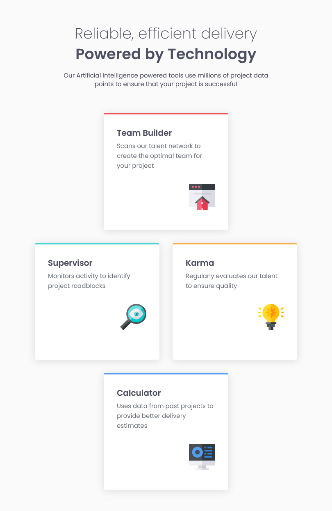

# Frontend Mentor - Four card feature section solution

This is a solution to the [Four card feature section challenge on Frontend Mentor](https://www.frontendmentor.io/challenges/four-card-feature-section-weK1eFYK). Frontend Mentor challenges help you improve your coding skills by building realistic projects. 

## Table of contents

- [Overview](#overview)
  - [The challenge](#the-challenge)
  - [Screenshot](#screenshot)
  - [Links](#links)
- [My process](#my-process)
  - [Built with](#built-with)
  - [What I learned](#what-i-learned)
  - [Continued development](#continued-development)
  - [Useful resources](#useful-resources)
- [Author](#author)
- [Acknowledgments](#acknowledgments)

## Overview

### The challenge

Users should be able to:

- View the optimal layout for the site depending on their device's screen size

### Screenshot

#### Mobile

#### Tablet

#### Desktop

### Links

- Solution URL: [Github: Four Card Feature Section](https://github.com/ashkir004/four-card-feature-section)
- Live Site URL: [Netlify: four-card-feature-section-ashkir004](https://four-card-feature-section-ashkir004.netlify.app/)

## My process

### Built with

- Semantic HTML5 markup
- CSS custom properties
- Flexbox
- CSS Grid
- Mobile-first workflow

### What I learned

- How to build a project using CSS Grid

### Continued development

- Add support for Laptops

### Useful resources

- [Interactive Guide to Grid](https://www.joshwcomeau.com/css/interactive-guide-to-grid/)

## Author

- Frontend Mentor - [@ashkir004](https://www.frontendmentor.io/profile/ashkir004)
- Github - [@ashkir004](https://www.github.com/ashkir004)

## Acknowledgments

- [Frontendmentor.io](https://www.frontendmentor.io)

